# OficinaPro — Códigos PlantUML dos Diagramas

Este arquivo reúne todos os códigos PlantUML gerados para o projeto OficinaPro.

Total de diagramas: 17.

## 01_casos_de_uso.puml

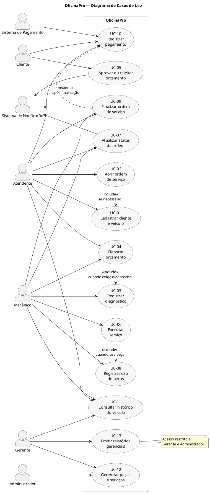

## 02_sistema_sequence_uc02_abrir_ordem.puml

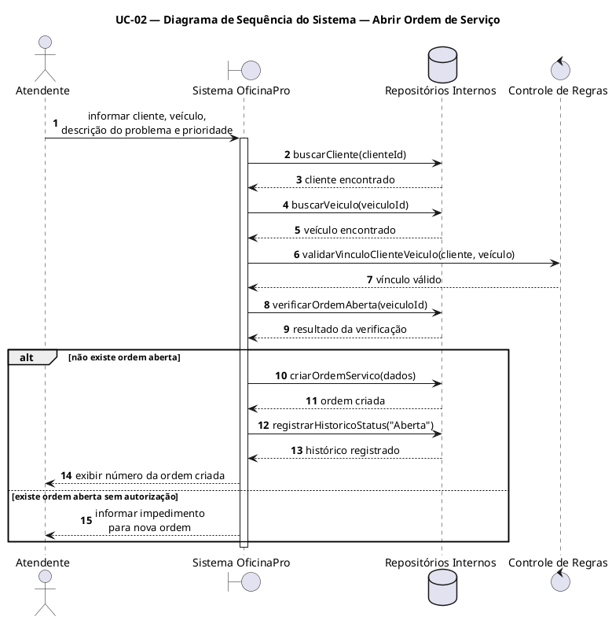

## 03_sistema_sequence_uc05_aprovar_orcamento.puml

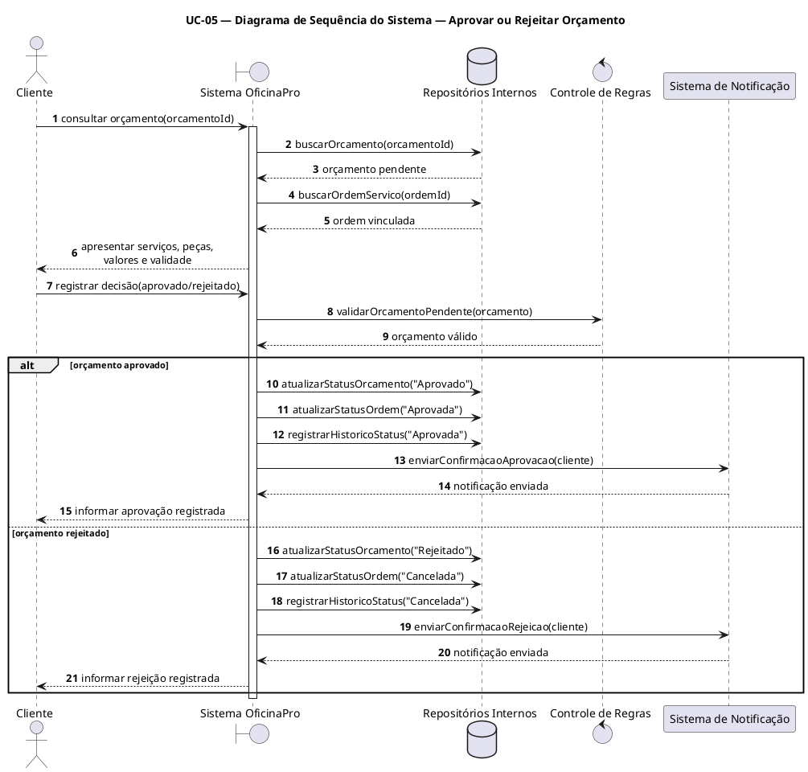

## 04_sistema_sequence_uc10_registrar_pagamento.puml

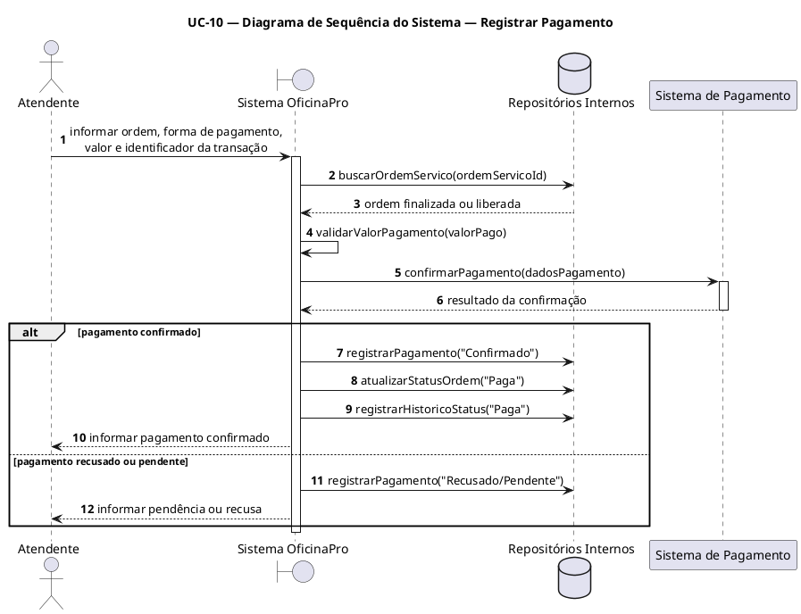

## 05_arquitetura.puml

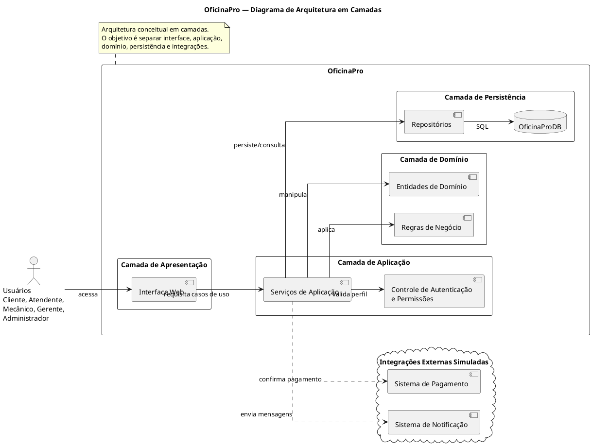

## 06_componentes.puml

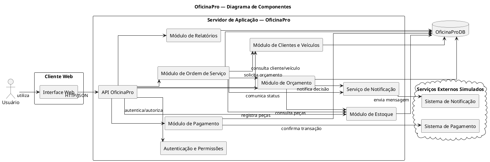

## 07_implantacao.puml

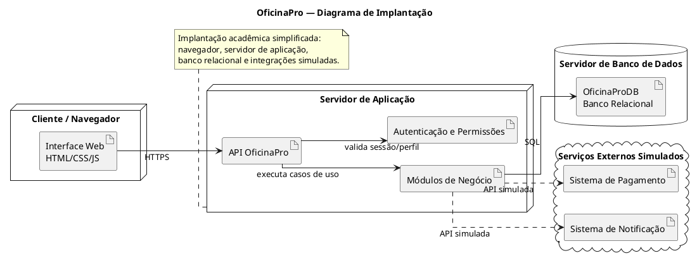

## 08_classes.puml

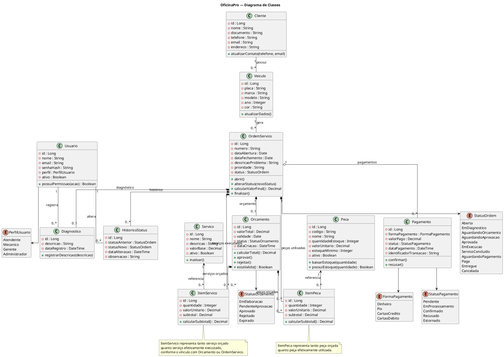

## 09_projeto_sequence_uc02_abrir_ordem.puml

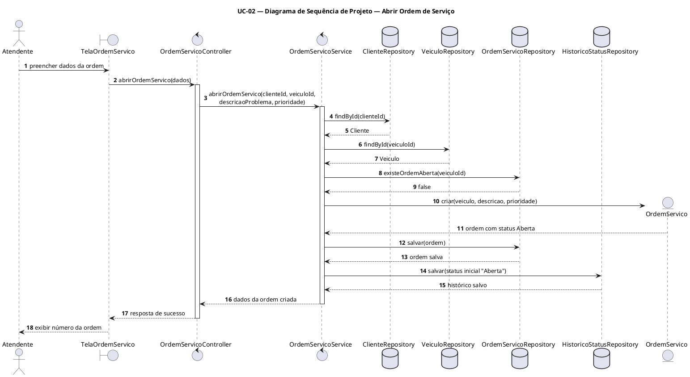

## 10_projeto_sequence_uc04_uc05_orcamento_aprovacao.puml

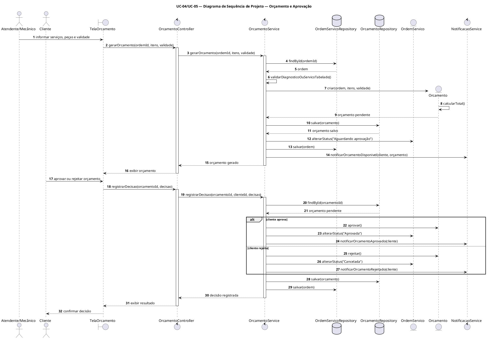

## 11_projeto_sequence_uc10_registrar_pagamento.puml

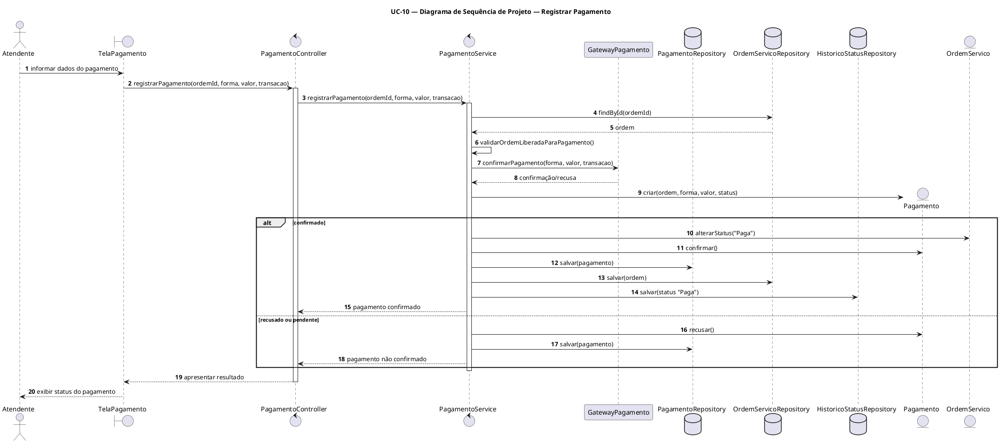

## 12_comunicacao_uc02_abrir_ordem.puml

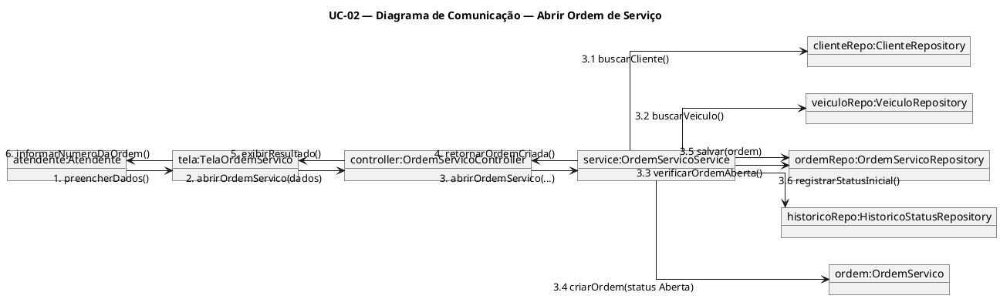

## 13_comunicacao_uc05_aprovar_orcamento.puml

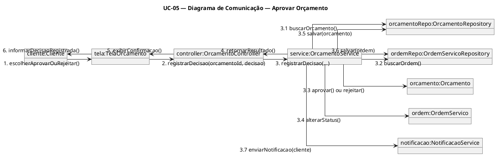

## 14_comunicacao_uc10_registrar_pagamento.puml

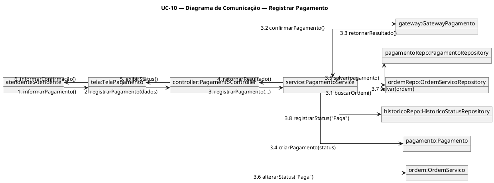

## 15_estados_ordem_servico.puml

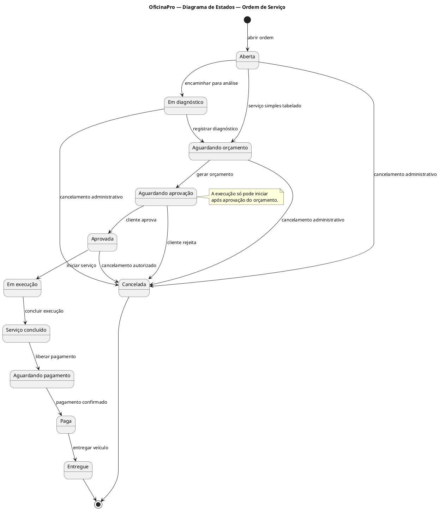

## 16_estados_orcamento_pagamento.puml

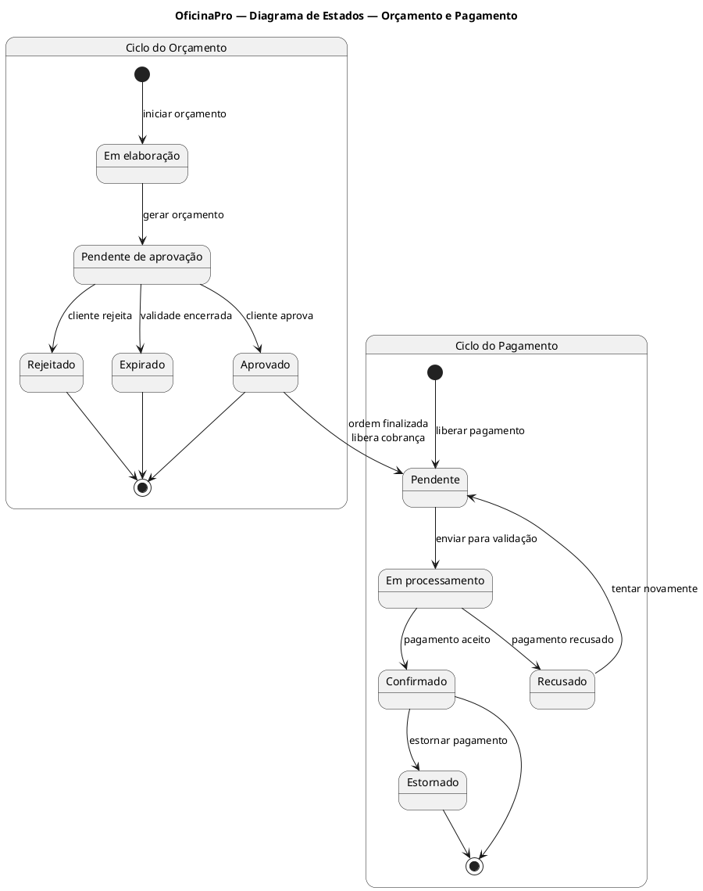

## 17_modelo_dados_der.puml

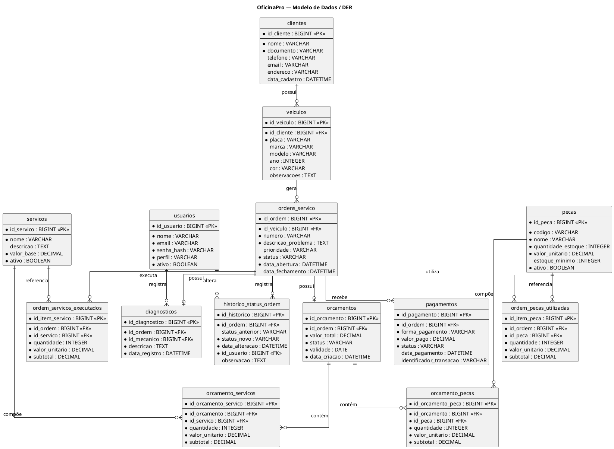
